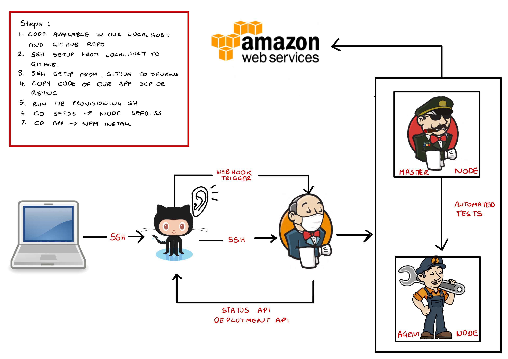

# CICD with Jenkins 

## CI/CD
CI/CD is a method to frequently deliver apps to customers by introducing automation into the stages of app development. The main concepts attributed to CI/CD are continuous integration, continuous delivery, and continuous deployment.

## Jenkins 
Jenkins is a free and open source automation server. It helps automate the parts of software development related to building, testing, and deploying, facilitating continuous integration and continuous delivery.

## Setting up a Job in Jenkins 
 
**Step 1: Create new item**
- On the left you should see `New item`, select that. 

**Step 2: Create job**
- Under `Enter an item anme` write the appropriate name for your job 

## SSH Connection Between Github and Jenkins 

**Step 1: Generate a new key**
- Generate a new ssh key in your localhost and name is YOURNAMEjenkins(eg brittanyjenkins). Steps to gerating a key can be found [here](https://github.com/brittanyharrison/engi_89_github_setup#step-2-generate-ssh-key). 

**Step 2: Copy Key into Github**
- Go into your repoo and select `Settings`
- Select `Deploy Keys` and select `Add deploy key`
- Copy the public ssh key into `key` and title YOURNAMEjenkins 
- Now select `Add key`
- **PENDING...**

